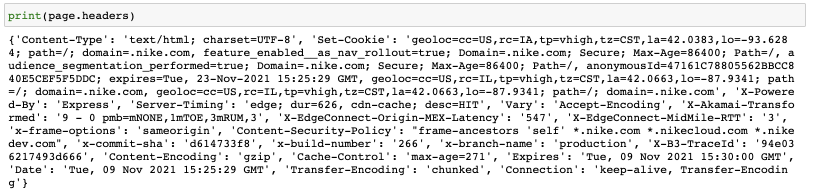
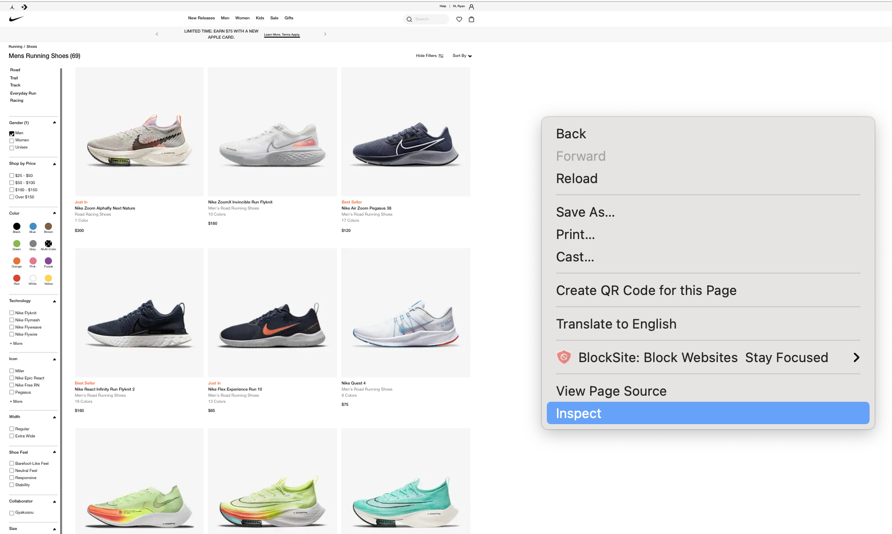
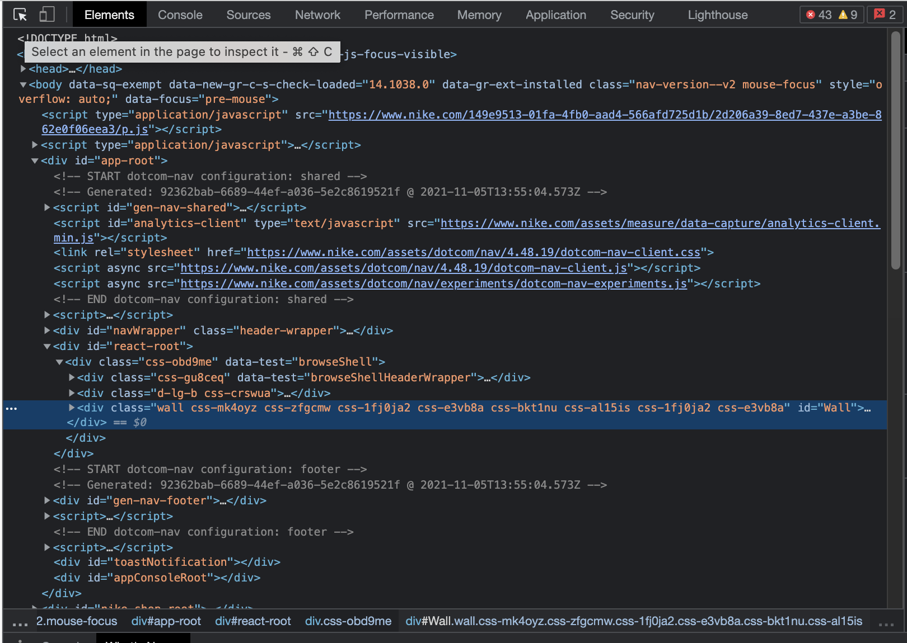
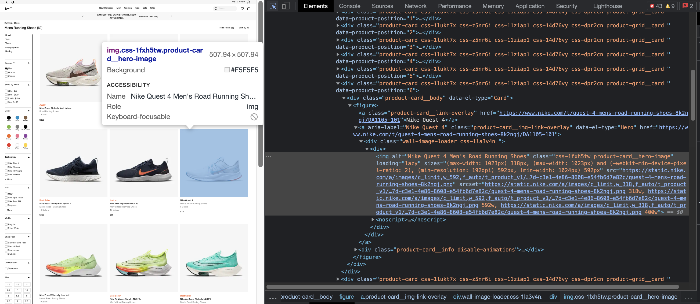

## Nike Passion Project: What Shoe Colors are NOW IN STYLE?!

# Project Workflow: 
1. Ask an interesting question: 
2. Obtain the data
3. Explore the data
4. Communicate and visualize the results


### 1. Ask as interesting question: 

For athletes, shoes provide comfort, protection, and performance. But there are so many different types. On the inevitable day my Romaleos 3 finally tore at the seams, I thought of the question: which color Romaleos 5 should I buy? 

As a graduate student in computer vision and data science, this got me thinking how to answer the question...

# What shoe colors are in style?

Take a look at the new releases in the mens section- where do we even begin? 

<p align="center">
    
</p>


# 2. Obtain the data: 

I think using some Python packages, we can answer this question using data science and computer vision! 

Can we also see color palette patterns associated with different shoe types? What about across season? Lots of questions we can answer! 

### Import Packages: 

```yml
import requests
from bs4 import BeautifulSoup
import pandas as pd
import numpy as np
import time
import matplotlib
import PIL, PIL.Image
import webcolors

```
### Web Scraping: 
```yml
page = requests.get("https://www.nike.com/w/mens-soccer-shoes-1gdj0znik1zy7ok")
soup = BeautifulSoup(page.content, 'html.parser')
page.status_code

```
Make sure you get an output of 200 when running this code block!

```yml
print(page.headers)
```
This line will give you an idea of what sort of data we are working with. 



Now I like to hop over to the Nike website, and right click -> inspect.


When you do that, a whole matrix like HTML code block will explode all over your screen! But no worries, be sure to click the very top left corner, where you can see a mouse. That will allow you to navigate your way through this giant mess of HTML code. 


Hover your mouse over to any image on the Nike site. You'll notice that the code blocks will start highlighting to represent the sections of code where the giant code block your mouse is pointing at, is referring to. 




I notice that all the image links are located in a code block with  
Its discriminatory but we can pull each URL out using that
```yml
#for link in soup.find_all('img'):
    #print(link.get('src'))

df = pd.DataFrame(columns = ["NikeShoe_URLs"])
for link in soup.find_all('img', attrs = {'class' : 'css-1fxh5tw product-card__hero-image'}):
    shoes = link.get('src')
    print(shoes)
    df.loc[len(df.index)] = [shoes]
URL_table = df[~df.NikeShoe_URLs.str.contains("data:image/gif;base64,")]
URL_table.head(10)
```
What this code block should give us, is a table of Nike URL's that we will use to parse multiple shoes at a single time!

# 3. Explore the data:

### Skateboard shoes:

```
df_colors = pd.DataFrame(columns = ["Colors"])
appended_data = []
for i in range(10):
    df_colors = pd.DataFrame(columns = ["Colors"])
    urllib.request.urlretrieve(shoes.NikeShoe_URLs[i], "image.png")
    img = PIL.Image.open("image.png")
    colors_RGB = extract_colorz(img)
    #print(colors_RGB)
    df_colors = pd.DataFrame(colors_RGB, columns=['RGB', 'Pixel #'])
    df_colors['Color'] = df_colors['RGB'].map(lambda RGB: convert_rgb_to_names(RGB))
    #df_colors['ShoeNumber'] = i
    appended_data.append(df_colors)
    #print(appended_data)
Skateboard_data = pd.concat(appended_data)
Skateboard_data["Pixel #"] = pd.to_numeric(Skateboard_data["Pixel #"])
Skateboard_data["Color"] = Skateboard_data["Color"].astype(str)
Skateboard_data.head(20)
aggregation_functions = {'Pixel #': 'sum'}
df_sb = Skateboard_data.groupby(Skateboard_data['Color']).aggregate(aggregation_functions)
df_sb = df_sb.sort_values(by = ['Pixel #'], ascending=False)
df_sb['ShoeColors'] = df_sb.index
df_sb['ShoeColors'] = df_sb['ShoeColors'].str[2:-2]
df_sb.reset_index(drop=True, inplace=True)
df_sb.rename(columns={'Pixel #': 'Skateboard Shoes Pixels', 'ShoeColors': 'Skateboard Shoe Colors'}, inplace=True)
df_sb.head(15)
```

<p align="center">
    
</p>


### Sandals and Slides
```
page = requests.get("https://www.nike.com/w/mens-sandals-slides-fl76znik1")
soup = BeautifulSoup(page.content, 'html.parser')
page.status_code

#for link in soup.find_all('img'):
    #print(link.get('src'))
df = pd.DataFrame(columns = ["NikeShoe_URLs"])

for link in soup.find_all('img', attrs = {'class' : 'css-1fxh5tw product-card__hero-image'}):
    shoes = link.get('src')
    #print(shoes)
    df.loc[len(df.index)] = [shoes]

URL_table = df[~df.NikeShoe_URLs.str.contains("data:image/gif;base64,")]
URL_table.head(5)
shoes = URL_table.reset_index(drop=True)
#shoes.head(5)
#shoes.NikeShoe_URLs[1]

df_colors = pd.DataFrame(columns = ["Colors"])
appended_data = []
for i in range(10):
    df_colors = pd.DataFrame(columns = ["Colors"])
    urllib.request.urlretrieve(shoes.NikeShoe_URLs[i], "image.png")
    img = PIL.Image.open("image.png")
    colors_RGB = extract_colorz(img)
    #print(colors_RGB)
    df_colors = pd.DataFrame(colors_RGB, columns=['RGB', 'Pixel #'])
    df_colors['Color'] = df_colors['RGB'].map(lambda RGB: convert_rgb_to_names(RGB))
    #df_colors['ShoeNumber'] = i
    appended_data.append(df_colors)
    #print(appended_data)
sandals_data = pd.concat(appended_data)
sandals_data["Pixel #"] = pd.to_numeric(sandals_data["Pixel #"])
sandals_data["Color"] = sandals_data["Color"].astype(str)
sandals_data.head(20)
aggregation_functions = {'Pixel #': 'sum'}
df_sandals = sandals_data.groupby(sandals_data['Color']).aggregate(aggregation_functions)
df_sandals = df_sandals.sort_values(by = ['Pixel #'], ascending=False)
df_sandals['ShoeColors'] = df_sandals.index
df_sandals['ShoeColors'] = df_sandals['ShoeColors'].str[2:-2]
df_sandals.reset_index(drop=True, inplace=True)
df_sandals.rename(columns={'Pixel #': 'Sandals/Slides Pixels', 'ShoeColors': 'Sandals/Slides Colors'}, inplace=True)
df_sandals.head(15)
```
<p align="center">
    

</p>


### Soccer Cleats

```
df_colors = pd.DataFrame(columns = ["Colors"])
appended_data = []
for i in range(10):
    df_colors = pd.DataFrame(columns = ["Colors"])
    urllib.request.urlretrieve(shoes.NikeShoe_URLs[i], "image.png")
    img = PIL.Image.open("image.png")
    colors_RGB = extract_colorz(img)
    #print(colors_RGB)
    df_colors = pd.DataFrame(colors_RGB, columns=['RGB', 'Pixel #'])
    df_colors['Color'] = df_colors['RGB'].map(lambda RGB: convert_rgb_to_names(RGB))
    #df_colors['ShoeNumber'] = i
    appended_data.append(df_colors)
    #print(appended_data)
final_data = pd.concat(appended_data)
final_data["Pixel #"] = pd.to_numeric(final_data["Pixel #"])
final_data["Color"] = final_data["Color"].astype(str)
final_data.head(20)
aggregation_functions = {'Pixel #': 'sum'}
df_cleats = final_data.groupby(final_data['Color']).aggregate(aggregation_functions)
df_final = df_cleats.sort_values(by = ['Pixel #'], ascending=False)
df_final['ShoeColors'] = df_final.index
df_final['ShoeColors'] = df_final['ShoeColors'].str[2:-2]
df_final.reset_index(drop=True, inplace=True)
df_final.rename(columns={'Pixel #': 'Cleats Pixels', 'ShoeColors': 'Cleat Colors'}, inplace=True)
df_final.head(15)
```
<p align="center">
    

</p>


Now we have three datasets for (1) Skatboarding shoes, (2) Sandals/Slides and (3) Soccer cleats.
Now we have to compile and organize the dataset! 
```
df_final['Skateboard Shoes Colors'] = df_sb['Skateboard Shoe Colors']
df_final['Sandals/Slides Colors'] = df_sandals['Sandals/Slides Colors']
df_final.head(50)
df_final['Skateboard Shoes Pixels'] = df_sb['Skateboard Shoes Pixels']
df_final['Sandals/Slides Pixels'] = df_sandals['Sandals/Slides Pixels']
#df_final.head(50)
```
Lets re order the columns and clean the dataframe up
```
cols = list(df_final.columns.values)
#print(cols)
shoe_colors_in_style = df_final[['Cleat Colors', 'Sandals/Slides Colors', 'Skateboard Shoes Colors',  'Cleats Pixels', 'Sandals/Slides Pixels', 'Skateboard Shoes Pixels' ]]
```
# 4. Visualize the dataset:

A compiled dataset:
```
shoe_colors_in_style.head(50)
```
<p align="center">
    

</p>


Lets make barplots using the Seaborn package:
<p align="center">
    
    
    
</p>


# Discussion:
The biggest thing I noticed was that soccer cleats had the most variety of colors, while sandals had the smallest variety. We can see that towards the bottom of the concatenated data frame. I also notice that most of the colors from the sandal variety were dark muted colors, while those from the cleats were often more warm and vibrant. 

# Future work:
Can we somehow implement machine learning to get similar results? Perhaps a KMeans to determine colors instead of using pixel frequency? 
